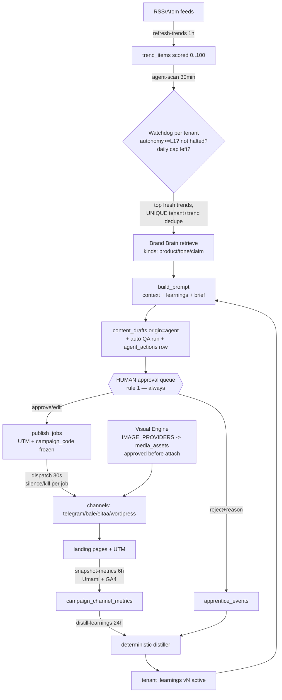

# Fable-5 Pentarchy — Architecture Design (M20–M24)

**Status:** design accepted, implementation pending (one milestone per session, test-first)
**Grounding:** every claim below was verified against the code by a 5-reader
subsystem sweep (brain/RAG, content/QA/governance, publisher/renderer,
measurement, auth/vault/workers) on 2026-07-18. File:line references are real.

The five epics turn RPIM from a supervised pipeline into a proactive agency
**without touching rule 1**: the machine may propose, retrieve, generate,
measure and learn — a human still approves everything that publishes.

---

## 0. Constitution guardrails decided up front

| Ask | Verdict | Why |
|---|---|---|
| ChromaDB for M20 | **Rejected** | pgvector 1024-dim HNSW already indexes `brain_chunks` (migration 0004). A second vector store splits retrieval into two code paths and adds an unmanaged service. |
| Midjourney adapter for M21 | **Rejected — rule 5** | Midjourney has no official API; the only automation path is Discord-bot puppeting, which is browser/automation territory. DALL-E-style official APIs only (`gpt-image-1`/`dall-e-3` via OpenAI-compatible `images/generations`, Imagen via Gemini API). |
| Telegram CTR for M22 | **Scoped honestly** | The official Bot API exposes no view counts for channel posts; MTProto userbots are automation the constitution forbids. CTR numerator = our own UTM clicks (Umami today, GA4 added); denominator = posts sent. Native telegram views wait for an official surface. |
| Agent auto-publish for M23 | **Never** | Watchdog output lands as `origin="agent"` drafts in the existing approval queue, auto-QA'd, silence-aware. Publishing still requires a human (rule 1); autonomy L2/L3 remain blueprint-future. |
| AES-GCM-256 for M24 | **Accepted, versioned** | Fernet (v1) stays readable; new seals are `v2:` AES-GCM-256 **with per-row AAD** — fixing a real weakness: today a sealed blob copied between rows decrypts fine (no context binding). |

---

## 1. Database delta — five migrations, numbered and ordered

Migration chain head today: `0014`. All tables follow house conventions:
`String(32)` uuid4-hex PKs via `_uuid`, tz-aware stamps via `_now`
(`now_app()` — the RPIM_TIMEZONE lever, ADR 0032), tenant FK indexed, and an
idempotent upsert key per rule 8. Every tenant-scoped table ships with a
cross-tenant isolation test (rule 6).

### 0015 — M20 `brand knowledge kinds` (extend, don't duplicate)

The Brand Brain already stores knowledge (`brain_sources` + `brain_chunks`,
models.py:57–81). M20 makes it **kind-aware** instead of adding a parallel
`brand_knowledge` table that would split the HNSW index:

```text
ALTER brain_sources
  ADD meta JSON NULL              -- structured catalog fields for kind=product:
                                  -- {name, sku, price, features[], url}
ALTER brain_chunks
  ADD kind VARCHAR(16) NOT NULL SERVER_DEFAULT 'doc'
CREATE INDEX ix_brain_chunks_tenant_kind ON brain_chunks (tenant_id, kind)
-- backfill: chunk.kind := parent source.kind mapped through
--   upload|crawl|pdf -> 'doc'   (data migration in the same revision)
```

Governed kind taxonomy (validated at the API door, free-form no more):
`product | tone | faq | claim | doc` — ingest paths keep writing
`upload/crawl/pdf` into `brain_sources.kind` as *provenance*; the new
`brain_chunks.kind` is the *retrieval* facet.

### 0016 — M21 `media_assets` (+ publish-job dead-letter)

Nothing persists media today: PNGs are re-rendered per retry and the
WordPress photo path is a stub that retries forever (channels.py:121–125).

```text
CREATE TABLE media_assets (
  id            VARCHAR(32) PK,
  tenant_id     VARCHAR(32) FK tenants.id, INDEXED,          -- rule 6
  kind          VARCHAR(16) NOT NULL,      -- generated | rendered
  prompt_id     VARCHAR(32) FK visual_prompts.id NULL,       -- studio lineage
  provider      VARCHAR(32) NOT NULL DEFAULT '',             -- openai | gemini | renderer | fake
  model         VARCHAR(64) NOT NULL DEFAULT '',
  prompt_text   VARCHAR(4000) NOT NULL DEFAULT '',
  alt_text      VARCHAR(300) NOT NULL DEFAULT '',            -- SEO fa alt, deterministic
  sha256        VARCHAR(64) NOT NULL,
  mime          VARCHAR(32) NOT NULL DEFAULT 'image/png',
  width         INTEGER, height INTEGER,
  storage_path  VARCHAR(500) NOT NULL,                       -- volume path, bytes never in DB
  wp_media_id   INTEGER NULL,               -- step-1 receipt => retry resumes at step 2 (rule 8)
  status        VARCHAR(16) NOT NULL DEFAULT 'draft',        -- draft | approved | attached
  cost_usd      FLOAT NOT NULL DEFAULT 0,
  created_at    TIMESTAMPTZ,
  UNIQUE (tenant_id, sha256)                -- content-addressed dedupe
)
```

`publish_jobs` needs **no schema change** for resilience: `status` is a free
string — the engine gains `MAX_PUBLISH_ATTEMPTS` (env, default 20) and marks
exhausted jobs `stalled` (operator surface in the queue page + manual
requeue endpoint) instead of retrying forever. `image_spec` JSON grows a
discriminator: `{kind: "template"|"generated", template?, size, media_asset_id?}` —
JSON column, so only Pydantic changes.

### 0017 — M22 `campaign_channel_metrics` + `tenant_learnings`

```text
CREATE TABLE campaign_channel_metrics (
  id            VARCHAR(32) PK,
  tenant_id     VARCHAR(32) FK tenants.id, INDEXED,
  campaign_code VARCHAR(120) NOT NULL,
  channel       VARCHAR(16)  NOT NULL,      -- telegram | bale | eitaa | wordpress | web
  day           VARCHAR(10)  NOT NULL,      -- YYYY-MM-DD in app TZ (single lever)
  source        VARCHAR(16)  NOT NULL,      -- umami | ga4
  clicks        INTEGER NOT NULL DEFAULT 0,
  sessions      INTEGER NOT NULL DEFAULT 0,
  impressions   INTEGER NULL,               -- NULL = source can't know (honesty over zeros)
  captured_at   TIMESTAMPTZ,
  UNIQUE (tenant_id, campaign_code, channel, source, day)   -- idempotent snapshot (rule 8)
)

CREATE TABLE tenant_learnings (
  id          VARCHAR(32) PK,
  tenant_id   VARCHAR(32) FK tenants.id, INDEXED,
  version     INTEGER NOT NULL,
  directives  JSON NOT NULL,     -- [{key, text_fa, weight}] — capped, prompt-ready
  evidence    JSON NOT NULL,     -- {campaign_scores, rejection_counters, apprentice_event_ids}
  status      VARCHAR(16) NOT NULL DEFAULT 'active',   -- active | retired
  created_at  TIMESTAMPTZ,
  UNIQUE (tenant_id, version)
)
```

The distiller is **deterministic and reviewable** (rule-based over metrics +
`apprentice_events` rejection counters), not an LLM free-writer; owners see
and can retire learnings in the dashboard (rule 1 spirit: the brand voice
stays under human control). Only the latest `active` version is injected
into prompts, capped at 600 chars. GA4 credentials ride the existing hub
vault as a new **analytics-only** connection kind `ga4`
(`ANALYTICS_CONNECTIONS`, never publishable — `SUPPORTED_CHANNELS` untouched).

### 0018 — M23 `agent_actions` + autonomy + draft origin

```text
ALTER tenants        ADD autonomy_level INTEGER NOT NULL SERVER_DEFAULT 0   -- L0
ALTER content_drafts ADD origin VARCHAR(16) NOT NULL SERVER_DEFAULT 'human' -- human | agent

CREATE TABLE agent_actions (
  id            VARCHAR(32) PK,
  tenant_id     VARCHAR(32) FK tenants.id, INDEXED,
  kind          VARCHAR(24) NOT NULL DEFAULT 'brief_proposal',
  trend_item_id VARCHAR(32) FK trend_items.id NULL,
  draft_id      VARCHAR(32) FK content_drafts.id NULL,
  score         INTEGER NOT NULL DEFAULT 0,        -- trend score at proposal time
  rationale     VARCHAR(1000) NOT NULL DEFAULT '', -- why the watchdog proposed (fa, audit)
  status        VARCHAR(16) NOT NULL DEFAULT 'proposed', -- proposed | accepted | dismissed
  created_at    TIMESTAMPTZ,
  UNIQUE (tenant_id, trend_item_id, kind)          -- a trend is proposed at most once (rule 8)
)
```

### 0019 — M24 `users.role` + `tenant_invites`

```text
ALTER users ADD role VARCHAR(16) NOT NULL SERVER_DEFAULT 'owner'
-- backfill 'owner' is semantically exact: today every user registered
-- their own tenant and is its sole member (models.py:35)

CREATE TABLE tenant_invites (
  id          VARCHAR(32) PK,
  tenant_id   VARCHAR(32) FK tenants.id, INDEXED,
  email       VARCHAR(320) NOT NULL,
  role        VARCHAR(16)  NOT NULL,          -- editor | observer (owner never invited)
  token_hash  VARCHAR(64)  NOT NULL UNIQUE,   -- sha256; raw token shown once, never stored
  expires_at  TIMESTAMPTZ NOT NULL,
  used_at     TIMESTAMPTZ NULL,
  created_at  TIMESTAMPTZ
)
```

Role matrix (enforced by a `require_role(minimum)` dependency layered on
`get_identity`, DB-read per request like `get_admin_identity` — fresh,
revocable, no stale JWT claims):

| Surface | observer | editor | owner |
|---|---|---|---|
| Reports, queue, trends, brain search (GET) | ✅ | ✅ | ✅ |
| Briefs, drafts, approve/reject, studio, publish jobs | — | ✅ | ✅ |
| Brand profile writes, channel secrets, export, silence, invites, autonomy level | — | — | ✅ |

Vault v2 (same migration window, no schema change — `secret_sealed`
String(2000) fits): sealed format `v2:` + base64(nonce‖ciphertext),
AES-GCM-256 keyed by env `CHANNEL_SECRET_KEY_V2`, **AAD =
`{tenant_id}:{channel}`** so a sealed blob is bound to its row. `unseal`
dispatches on the prefix (Fernet tokens always start `gAAAA` — unambiguous);
v1 stays readable during transition; hub PUT writes v2 immediately; a lazy
re-seal happens inside `tenant_creds.resolve` (it already holds the Session).
Error contract preserved: seal failure → 503 at the API door; unseal failure
→ `ChannelSendError`, job stays queued, **never** a fallback to the global
identity.

---

## 2. Worker architecture — the autonomous cycle

Beat stays a *dumb poker* (established pattern, tasks.py): every task POSTs
an internal core-api endpoint with `X-Internal-Token`; idempotency, tenant
scoping, halt checks and caps all live inside core-api — a hijacked beat can
only call more often (rule 2 preserved: the silence check stays per-job
inside `dispatch_due_jobs`, upstream of every send).

| Beat entry | Cadence | Pokes | Epic |
|---|---|---|---|
| dispatch-publish-queue | 30 s | POST /publish/dispatch | exists |
| sync-crm-leads | 300 s | POST /crm/sync | exists |
| refresh-trends | 1 h | POST /trends/refresh | exists |
| refresh-ai-news | 6 h | POST /admin/ai-news/refresh | exists |
| **snapshot-metrics** | 6 h | POST /metrics/snapshot | M22 |
| **distill-learnings** | 24 h | POST /learnings/distill | M22 |
| **agent-scan** | 30 min | POST /agent/scan | M23 |



Watchdog guardrails, in order of checking: autonomy level (L0 = never runs)
→ governance halt (silence/kill pauses proposals, resume is manual-only) →
daily proposal cap (`AGENT_DAILY_DRAFTS`, default 2 — every draft is a paid
T2 call, ledger-booked) → trend freshness + score threshold → the
`UNIQUE(tenant_id, trend_item_id, kind)` dedupe. A crashed scan re-runs
safely; a replayed scan proposes nothing twice.

---

## 3. Core logic blueprints (implementation lands test-first per milestone)

### 3.1 BrandBrain service (M20) — one retrieval API for every prompt

Extracted around the existing choke points (`search_chunks`
retrieval.py:16, `_ingest` brain.py:54) so content, studio and watchdog stop
hand-rolling retrieval:

```python
# apps/core-api/rpim_core_api/brain/service.py
KINDS = ("product", "tone", "faq", "claim", "doc")

class BrandBrain:
    """Tenant-scoped retrieval facade. Every prompt-building call site asks
    the brain; nobody touches search_chunks directly anymore."""

    def __init__(self, session: Session, tenant_id: str):
        self._session, self._tenant_id = session, tenant_id

    def retrieve(self, query: str, k: int = 5,
                 kinds: Sequence[str] | None = None) -> list[dict]:
        vector = embed_texts([query], tenant_id=self._tenant_id)[0]
        return search_chunks(self._session, self._tenant_id, vector,
                             k=k, kinds=kinds)          # kinds = new WHERE on the join

    def compose_context(self, chunks: list[dict], budget_chars: int = 3500) -> str:
        """Deterministic '[title] text' block, kind-grouped, hard-capped —
        the unbounded-context gap closes here."""
```

`search_chunks` gains `kinds: Sequence[str] | None` (one-line WHERE — it
already joins `BrainSource`). Call sites: `create_draft` (content.py:68)
switches to the facade; `studio.create_prompt` starts retrieving
(`kinds=("product", "tone")`, k=3) and threads context into
`expander.expand` — the studio is retrieval-free today and stops being so.

### 3.2 Image adapter registry (M21) — the text-provider pattern, mirrored

```python
# apps/model-gateway/rpim_model_gateway/image_providers.py
def _fake_image(model, prompt, size="1024x1024", timeout=120.0) -> dict:
    """Deterministic 1-px-pattern PNG seeded by sha256(prompt) — CI/dev."""

def _openai_image(model, prompt, size="1024x1024", timeout=120.0) -> dict:
    # POST {base}/v1/images/generations  (official API, rule 5)
    # key ONLY in Authorization header (rule 4), b64_json response
    # returns {"image_b64": ..., "units": 1}

IMAGE_PROVIDERS = {"fake": _fake_image, "openai": _openai_image,
                   "gemini": _gemini_imagen}
IMAGE_PRICES = {"gpt-image-1": 0.04, "dall-e-3": 0.04, "imagen-3": 0.03}  # USD/image

# main.py: POST /image  {prompt, size, tenant_id, request_id}
#   - X-Internal-Token gate, tenant-scoped idempotency key f"{tenant}:{request_id}"
#   - chain env MODEL_IMG="openai:gpt-image-1" + MODEL_IMG_FALLBACKS (same
#     link-walk as /complete — provider swap stays a config change, M17 style)
#   - ledger.record(task="image", units=1, cost_usd=IMAGE_PRICES[model])
```

Core-api side: `media/service.py` stores bytes under a volume path,
computes sha256 (dedupe), builds the **deterministic Persian SEO alt-text**
from the studio brief + brand lexicon, and persists the `media_assets` row
with `status="draft"` — a human approves the visual before any job may
attach it (rule 1 covers images, not just text).

WordPress media two-step (closing the forever-retry stub, channels.py:121):

```python
def _wordpress_send_photo(asset, caption, creds):
    if asset.wp_media_id is None:                       # step 1, once
        media = _post_multipart(f"{base}/wp-json/wp/v2/media",
                                file=asset.bytes, alt_text=asset.alt_text)
        persist(asset.wp_media_id = media["id"])        # receipt BEFORE step 2 (rule 8)
    _post_json(f"{base}/wp-json/wp/v2/posts",
               {"title": ..., "content": caption,
                "featured_media": asset.wp_media_id, "status": "publish"})
```

A retry after a mid-flight crash resumes at step 2 — no orphaned media, no
double upload. Persian glyphs stay out of generated pixels (renderer
constraint, templates.py:1–6): generated images serve as
backgrounds/illustrations; on-image Persian text keeps coming from the RTL
renderer templates.

### 3.3 Prompt assembly extraction (M22/M23 shared seam)

`create_draft`'s inline prompt build (content.py:75–96) becomes
`content/prompting.py: build_prompt(profile, context_block, brief,
learnings) -> tuple[system, prompt]` — same output for the same input
(golden-tested), plus one new capped section «آموخته‌های برند» fed by the
latest active `tenant_learnings`. The route and the watchdog both call the
extracted `generate_draft(session, tenant_id, brief, origin)` service.

### 3.4 Vault v2 (M24)

```python
# vault.py — v2 alongside v1, single dispatch point
def seal(plaintext: str, *, tenant_id: str, channel: str) -> str:
    key = _gcm_key()                                  # env CHANNEL_SECRET_KEY_V2
    nonce = os.urandom(12)
    aad = f"{tenant_id}:{channel}".encode()
    ct = AESGCM(key).encrypt(nonce, plaintext.encode(), aad)
    return "v2:" + base64.urlsafe_b64encode(nonce + ct).decode()

def unseal(sealed: str, *, tenant_id: str, channel: str) -> str:
    if sealed.startswith("v2:"): ...                  # AESGCM + AAD check
    return _fernet().decrypt(sealed.encode()).decode()  # v1 fallback (transition)
```

Both call sites already have `tenant_id` and `channel` in scope
(channels_hub.py:83, tenant_creds.py:29) — the signature change threads
cleanly.

---

## 4. The four stated engineering requirements, mapped

1. **Idempotency** — already load-bearing (job_id as cross-leg key,
   tenant-scoped `/complete` cache); every new write surface above carries
   its own unique key: media by `(tenant, sha256)` + `wp_media_id` receipt,
   metrics by `(tenant, campaign, channel, source, day)`, agent actions by
   `(tenant, trend, kind)`, learnings by `(tenant, version)`.
2. **Adapter pattern** — `IMAGE_PROVIDERS` mirrors `PROVIDERS` (M17):
   swapping OpenAI/Gemini image backends is an env change, zero logic edits.
3. **Clean architecture** — the design's main refactor: `BrandBrain`,
   `generate_draft`, `build_prompt`, `media/service` extract business logic
   out of route handlers; routers keep HTTP concerns only.
4. **Resilience** — the `ChannelSendError → stay queued` retry contract is
   kept and finally bounded: `MAX_PUBLISH_ATTEMPTS` → `stalled` dead-letter
   status with an operator requeue, replacing today's infinite retry.

## 5. Execution order and why

`M20 → M24 → M21 → M22 → M23` — brain kinds first (M23's grounding),
security second (roles/invites touch every router — cheapest while the
surface is small; vault v2 wants maximum bake time before enterprise
tenants), visuals third, feedback fourth (needs media/publish stable to
measure), watchdog last (composes M20's retrieval, M22's learnings, and the
approval queue). One milestone per session, failing tests first, ADR per
decision, blueprint-reviewer before every commit.
