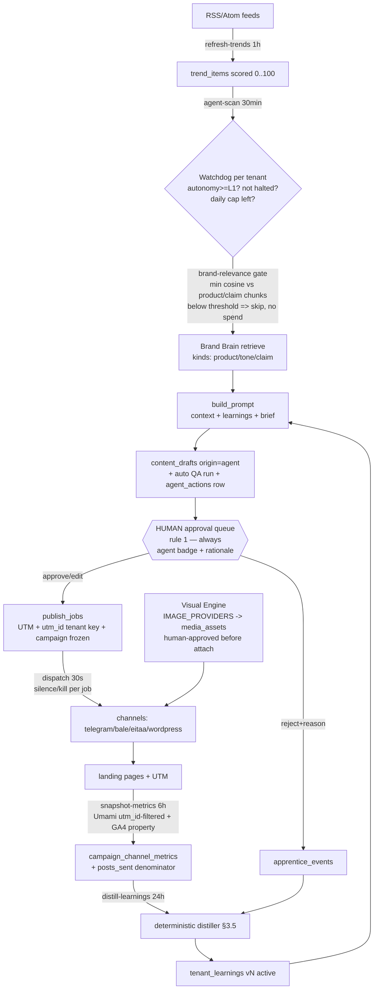

# Fable-5 Pentarchy — Architecture Design (M20–M24), v2

**Status:** design accepted after adversarial review, implementation pending
(one milestone per session, test-first).
**Grounding:** v1 was written from a 5-reader code sweep (brain/RAG,
content/QA/governance, publisher/renderer, measurement, auth/vault/workers);
v2 folds in a 3-lens adversarial review (constitution / feasibility /
completeness — 22 findings, all addressed below). File:line references are
real as of `b50ab81`.

The five epics turn RPIM from a supervised pipeline into a proactive agency
**without touching rule 1**: the machine may propose, retrieve, generate,
measure and learn — a human still approves everything that publishes, text
AND image.

---

## 0. Constitution guardrails decided up front

| Ask | Verdict | Why |
|---|---|---|
| ChromaDB for M20 | **Rejected** | pgvector 1024-dim HNSW already indexes `brain_chunks` (migration 0004). A second vector store splits retrieval into two code paths and adds an unmanaged service. |
| Midjourney adapter for M21 | **Rejected — rule 5** | No official API; the only automation path is Discord-bot puppeting. Official image APIs only: `gpt-image-1`/`dall-e-3` (OpenAI `images/generations`), Imagen (Gemini API). |
| Telegram CTR for M22 | **Scoped honestly** | The official Bot API exposes no view counts for channel posts; MTProto userbots are forbidden automation. CTR numerator = our UTM clicks (Umami + GA4); denominator = sent posts from `publish_jobs`. Native telegram views wait for an official surface. |
| Agent auto-publish for M23 | **Never** | Watchdog output lands as `origin="agent"` drafts in the existing approval queue, auto-QA'd, silence-aware, brand-relevance-gated. Publishing still requires a human (rule 1). |
| AES-GCM-256 for M24 | **Accepted, versioned** | Fernet (v1) stays readable; new seals are `v2:` AES-GCM-256 **with per-row AAD** — fixing a real weakness: today a sealed blob copied between rows decrypts fine. |
| GA4 service-account key in the hub vault | **Rejected (review finding)** | A GA4 service-account JSON (~2.3KB) exceeds both the hub door cap (`ConnectionIn.secret` ≤1000) and `secret_sealed` String(2000). Instead: ONE platform service account as a leg-level env NAME; tenants store only their **GA4 property_id** (non-secret config) and share the property with the service account — standard GA4 practice, zero secret material per tenant. |

---

## 1. Database delta — five migrations, numbered and ordered

Migration chain head today: `0014`. House conventions everywhere:
`String(32)` uuid4-hex PKs via `_uuid`, tz-aware stamps via `_now`
(`now_app()` — the RPIM_TIMEZONE lever, ADR 0032), tenant FK indexed,
idempotent upsert key per rule 8, cross-tenant isolation test per new
tenant-scoped table (rule 6). **Every migration below also extends
`export.py` and bumps `export_version`** — the one-click-full-export DoD
bullet is part of each milestone's acceptance tests, never an afterthought.

### 0015 — M20 `brand knowledge kinds` (extend, don't duplicate)

The Brand Brain already stores knowledge (`brain_sources` + `brain_chunks`,
models.py:57–81). M20 makes it **kind-aware** instead of adding a parallel
table that would split the HNSW index:

```text
ALTER brain_sources
  ADD meta JSON NULL              -- structured catalog fields for knowledge_kind=product:
                                  -- {name, sku, price, features[], url}
ALTER brain_chunks
  ADD kind VARCHAR(16) NOT NULL SERVER_DEFAULT 'doc'
CREATE INDEX ix_brain_chunks_tenant_kind ON brain_chunks (tenant_id, kind)
-- data migration in the same revision: chunk.kind := 'doc' for all existing rows
```

**Write path (review blocker, now designed):** provenance and knowledge
facet are separate fields. `brain_sources.kind` keeps recording
`upload|crawl|pdf` (how it got in); the source APIs gain a validated
`knowledge_kind: Literal["product","tone","faq","claim","doc"] = "doc"`
(what it is), which `_ingest` (brain.py:54) stamps onto every chunk it
creates. Product catalogs get a dedicated door:

- `POST /brain/catalog` — body `{products: [{name, sku?, price?, features[], url?}]}`;
  each product composes a canonical Persian text block (deterministic,
  golden-tested), embeds as one-or-few chunks with `kind="product"`, and
  stores the raw structure in `brain_sources.meta`. Upsert per (tenant,
  content_hash) — the existing dedupe constraint already gives rule 8.

**Retrieval fallback (review blocker, now designed):** kind-filtered
retrieval must degrade, not starve — when a tenant has no chunks of the
requested kinds, the filter widens to include `doc` (one COUNT probe), so
the studio and the watchdog work from day one on tenants that never curated
kinds.

### 0016 — M21 `media_assets` + publish-job time-based dead-letter

Nothing persists media today: PNGs are re-rendered per retry and the
WordPress photo path is a stub that retries forever (channels.py:121–125).

```text
CREATE TABLE media_assets (
  id            VARCHAR(32) PK,
  tenant_id     VARCHAR(32) FK tenants.id, INDEXED,          -- rule 6
  kind          VARCHAR(16) NOT NULL,      -- generated | rendered
  prompt_id     VARCHAR(32) FK visual_prompts.id NULL,       -- studio lineage
  provider      VARCHAR(32) NOT NULL DEFAULT '',             -- openai | gemini | renderer | fake
  model         VARCHAR(64) NOT NULL DEFAULT '',
  prompt_text   VARCHAR(4000) NOT NULL DEFAULT '',
  alt_text      VARCHAR(300) NOT NULL DEFAULT '',            -- SEO fa alt, deterministic
  sha256        VARCHAR(64) NOT NULL,
  mime          VARCHAR(32) NOT NULL DEFAULT 'image/png',
  width         INTEGER, height INTEGER,
  storage_path  VARCHAR(500) NOT NULL,                       -- volume path, bytes never in DB
  wp_media_id   INTEGER NULL,               -- step-1 receipt => retry resumes at step 2 (rule 8)
  status        VARCHAR(16) NOT NULL DEFAULT 'draft',        -- draft | approved | attached
  cost_usd      FLOAT NOT NULL DEFAULT 0,
  created_at    TIMESTAMPTZ,
  UNIQUE (tenant_id, sha256)                -- content-addressed dedupe
)

ALTER publish_jobs ADD first_failed_at TIMESTAMPTZ NULL   -- dead-letter clock
```

**Rule-1 + rule-6 enforcement for images (review blocker, now designed):**
`image_spec` grows `{kind: "template"|"generated", template?, size,
media_asset_id?}` — but the gate is **not** Pydantic:

- **Compile-time** (`create_job`, publish.py:81): a `media_asset_id` is
  resolved with a tenant-scoped query (`WHERE tenant_id =
  identity.tenant_id`); missing → 404, `status != "approved"` → 409
  (Persian locale error); success transitions the asset to `attached`.
- **Dispatch-time** (engine.py, defense in depth): the asset loader is
  keyed `(tenant_id, id)` and re-verifies `status in
  ("approved","attached")` before bytes leave the box.
- **Acceptance test named now:** tenant B's `media_asset_id` in tenant A's
  job → 404/409, never published; unapproved asset → 409, never published.

Media approval has a real surface: `POST /studio/media/{id}/approve`
(editor+) plus an approval strip on the studio page — the human approves
the *visual*, not just the text (rule 1 covers both).

**Dead-letter is time-based (review major, was attempts-based):** attempts
count at the 30s beat cadence, so any attempt-cap default is a ~minutes
window that would contradict "assume the tunnel WILL drop mid-job". The
engine stamps `first_failed_at` on the first `ChannelSendError`, clears it
on success, and marks a job `stalled` only when `now_app() -
first_failed_at > MAX_PUBLISH_RETRY_HOURS` (env, default 24). Blocked
passes (silence/kill) don't touch the clock — the current engine already
skips those without counting, and that stays. A vault-key outage therefore
keeps jobs safely queued for a full day before any operator action is
needed, preserving the tenant_creds invariant. Coordinated surfaces (review
finding): `stalled` chip + requeue button on **app/publish/page.tsx** (the
publish page, not the draft queue), `fa.publish.status_stalled` locale key,
and a `stalled` counter in `/reports/monthly`'s publish block.

### 0017 — M22 `campaign_channel_metrics` + `tenant_learnings`

```text
CREATE TABLE campaign_channel_metrics (
  id            VARCHAR(32) PK,
  tenant_id     VARCHAR(32) FK tenants.id, INDEXED,
  campaign_code VARCHAR(120) NOT NULL,
  channel       VARCHAR(16)  NOT NULL,      -- telegram | bale | eitaa | wordpress | web
  day           VARCHAR(10)  NOT NULL,      -- YYYY-MM-DD; app-TZ for umami, SOURCE-LOCAL for ga4 (see below)
  source        VARCHAR(16)  NOT NULL,      -- umami | ga4
  clicks        INTEGER NOT NULL DEFAULT 0,
  sessions      INTEGER NOT NULL DEFAULT 0,
  impressions   INTEGER NULL,               -- NULL = source can't know (honesty over zeros)
  posts_sent    INTEGER NOT NULL DEFAULT 0, -- CTR denominator, aggregated from publish_jobs
  captured_at   TIMESTAMPTZ,
  UNIQUE (tenant_id, campaign_code, channel, source, day)   -- idempotent snapshot (rule 8)
)

CREATE TABLE tenant_learnings (
  id           VARCHAR(32) PK,
  tenant_id    VARCHAR(32) FK tenants.id, INDEXED,
  version      INTEGER NOT NULL,
  directives   JSON NOT NULL,     -- [{key, text_fa, weight}] — capped, prompt-ready
  evidence     JSON NOT NULL,     -- {campaign_scores, rejection_counters, apprentice_event_ids}
  content_hash VARCHAR(64) NOT NULL,   -- distiller no-op key (rule 8, see §3.5)
  status       VARCHAR(16) NOT NULL DEFAULT 'active',   -- active | retired
  created_at   TIMESTAMPTZ,
  UNIQUE (tenant_id, version)
)
```

**Tenant-unique attribution (review major — rule 6):** `campaign_code` is a
free tenant-chosen string on a SHARED Umami site, so two tenants using
`spring-sale` would ingest each other's clicks straight into their
learnings. Fix at the source: `_build_utm` (publish.py:55) additionally
stamps `utm_id = "t-" + tenant_id[:12]` (propagated through
`build_landing_url`, which already replaces-never-duplicates), and the
snapshot query filters by the tenant's own `utm_id` before counting.
Isolation test named now: two tenants, same campaign_code, snapshot must
not mix counts. (Per-tenant Umami sites remain a scale-out option; the UTM
key works on the shared site today.)

**GA4 (review major, redesigned):** one platform service account, env NAME
`GA4_CREDENTIALS_FILE` (rule 4 — the JSON never enters the repo or the
DB); per-tenant connection kind `ga4` stores only `{property_id}` in
non-secret `config` — **no secret at all** (`status="connected"` when
property_id present). Hub threading is explicit: `_require_channel` and
`list_channels` validate against `SUPPORTED_CHANNELS ∪
ANALYTICS_CONNECTIONS` (`("ga4",)`); `tenant_creds.resolve` and the publish
engine keep resolving `SUPPORTED_CHANNELS` only — an analytics connection
can never be published to. Dashboard channels page + `fa.channels_hub` gain
the ga4 card. GA4 `day` rows are recorded **source-local** (the GA4
property's own timezone, which we don't control); the onboarding checklist
tells tenants to set the property TZ to match RPIM's, and the distiller
never does cross-source day math — no hardcoded TZ conversion anywhere,
the lever stays the only knob.

### 0018 — M23 `agent_actions` + autonomy + draft origin

```text
ALTER tenants        ADD autonomy_level INTEGER NOT NULL SERVER_DEFAULT 0   -- L0
ALTER content_drafts ADD origin VARCHAR(16) NOT NULL SERVER_DEFAULT 'human' -- human | agent

CREATE TABLE agent_actions (
  id            VARCHAR(32) PK,
  tenant_id     VARCHAR(32) FK tenants.id, INDEXED,
  kind          VARCHAR(24) NOT NULL DEFAULT 'brief_proposal',
  trend_item_id VARCHAR(32) FK trend_items.id NOT NULL,   -- NOT NULL: the dedupe key must bite
  draft_id      VARCHAR(32) FK content_drafts.id NULL,    -- NULL until the draft exists
  score         INTEGER NOT NULL DEFAULT 0,      -- trend heat score at proposal time
  relevance     INTEGER NOT NULL DEFAULT 0,      -- brand-fit score 0..100 (see §3.6)
  rationale     VARCHAR(1000) NOT NULL DEFAULT '', -- why proposed (fa, audit trail)
  status        VARCHAR(16) NOT NULL DEFAULT 'proposed', -- proposed | accepted | dismissed
  created_at    TIMESTAMPTZ,
  UNIQUE (tenant_id, trend_item_id, kind)         -- a trend is proposed at most once (rule 8)
)
```

`trend_item_id` is NOT NULL by review finding — NULLs are distinct in
unique constraints, which would have voided the dedupe for any future
trendless kind; a kind that genuinely has no trend gets its own dedupe
design when it exists. Draft origin surfaces to the human (review finding):
`origin` + the proposing action's `rationale` join the `list_drafts`
payload and `DraftOut`, the queue page shows an agent badge
(`fa.queue.agent_badge`), and `/export` carries both.

### 0019 — M24 `users.role` + `tenant_invites`

```text
ALTER users ADD role VARCHAR(16) NOT NULL SERVER_DEFAULT 'owner'
-- backfill 'owner' is semantically exact: every existing user registered
-- their own tenant and is its sole member (models.py:35)

CREATE TABLE tenant_invites (
  id          VARCHAR(32) PK,
  tenant_id   VARCHAR(32) FK tenants.id, INDEXED,
  email       VARCHAR(320) NOT NULL,
  role        VARCHAR(16)  NOT NULL,          -- editor | observer (owner never invited)
  token_hash  VARCHAR(64)  NOT NULL UNIQUE,   -- sha256; raw token shown once, never stored
  expires_at  TIMESTAMPTZ NOT NULL,
  used_at     TIMESTAMPTZ NULL,
  created_at  TIMESTAMPTZ
)
```

**Invite collision rule (review major, now explicit):** `users.email` is
globally unique and a user belongs to exactly one tenant. v1 invites are
valid **only for emails with no existing user**; accepting with an
already-registered email → 409 with a Persian locale error. No account is
ever re-pointed across tenants — a membership table
(`user_tenant_memberships`) is explicitly out of M24 scope and gets its own
ADR if multi-tenant membership is ever wanted. Isolation test named now:
accepting an invite never grants access to, or moves data from, any
pre-existing tenant.

Role matrix (enforced by a `require_role(minimum)` dependency layered on
`get_identity`, DB-read per request like `get_admin_identity` — fresh,
revocable, no stale JWT claims):

| Surface | observer | editor | owner |
|---|---|---|---|
| Reports, queue, trends, brain search (GET) | ✅ | ✅ | ✅ |
| Briefs, drafts, approve/reject, studio + media approve, publish jobs | — | ✅ | ✅ |
| Brand profile writes, channel secrets, export, silence, invites, autonomy level | — | — | ✅ |

**Vault v2** (same milestone, no schema change — bot tokens fit
String(2000); the GA4 key no longer needs the vault at all): sealed format
`v2:` + base64(nonce‖ciphertext), AES-GCM-256 keyed by env
`CHANNEL_SECRET_KEY_V2`, **AAD = `{tenant_id}:{channel}`**. `unseal`
dispatches on the prefix (Fernet tokens always start `gAAAA`); v1 stays
readable during transition; hub PUT writes v2 immediately. Two review
findings folded in: (a) **every** v2 failure mode (`InvalidTag`, bad
base64, short blob) wraps into `VaultKeyError` so the engine's per-job
`except ChannelSendError` keeps isolating failures — a corrupt blob for
tenant A must never abort tenant B's dispatch in the same pass (test named
now); (b) the lazy re-seal in `tenant_creds.resolve` is **best-effort**:
v1 unseal succeeded → try v2 re-seal; if `CHANNEL_SECRET_KEY_V2` is
missing/invalid, log, keep the v1 blob, and return the working credential —
a key-rollout gap must never become a publish outage (test named now: v1
secret + missing V2 key ⇒ publish succeeds).

---

## 2. Worker architecture — the autonomous cycle

Beat stays a *dumb poker* (established pattern, tasks.py): every task POSTs
an internal core-api endpoint with `X-Internal-Token`; idempotency, tenant
scoping, halt checks and caps all live inside core-api — a hijacked beat
can only call more often (rule 2 preserved: the silence check stays per-job
inside `dispatch_due_jobs`, upstream of every send).

| Beat entry | Cadence | Pokes | Epic |
|---|---|---|---|
| dispatch-publish-queue | 30 s | POST /publish/dispatch | exists |
| sync-crm-leads | 300 s | POST /crm/sync | exists |
| refresh-trends | 1 h | POST /trends/refresh | exists |
| refresh-ai-news | 6 h | POST /admin/ai-news/refresh | exists |
| **snapshot-metrics** | 6 h | POST /metrics/snapshot | M22 |
| **distill-learnings** | 24 h | POST /learnings/distill | M22 |
| **agent-scan** | 30 min | POST /agent/scan | M23 |



Watchdog guardrails, in checking order: autonomy level (L0 = never runs) →
governance halt (silence/kill pauses proposals; resume manual-only) → daily
proposal cap (`AGENT_DAILY_DRAFTS`, default 2 — every draft is a paid T2
call, ledger-booked) → trend freshness + heat threshold → **brand-relevance
gate (§3.6)** → the `UNIQUE(tenant_id, trend_item_id, kind)` dedupe.
Cost-safety on replay (review finding): the T2 call carries a
deterministic `request_id = f"agent:{tenant_id}:{trend_item_id}"`, so the
gateway's tenant-scoped idempotency cache absorbs a crash-replay without
double-charging; the `agent_actions` claim row commits **before** the model
call.

---

## 3. Core logic blueprints (implementation lands test-first per milestone)

### 3.1 BrandBrain service (M20) — one retrieval API for every prompt

```python
# apps/core-api/rpim_core_api/brain/service.py
KINDS = ("product", "tone", "faq", "claim", "doc")

class BrandBrain:
    """Tenant-scoped retrieval facade. Every prompt-building call site asks
    the brain; nobody touches search_chunks directly anymore."""

    def __init__(self, session: Session, tenant_id: str):
        self._session, self._tenant_id = session, tenant_id

    def retrieve(self, query: str, k: int = 5,
                 kinds: Sequence[str] | None = None) -> list[dict]:
        vector = embed_texts([query], tenant_id=self._tenant_id)[0]
        if kinds and not self._has_kinded_chunks(kinds):
            kinds = (*kinds, "doc")          # degrade, never starve (§1 0015)
        return search_chunks(self._session, self._tenant_id, vector,
                             k=k, kinds=kinds)   # kinds = WHERE on the existing join

    def compose_context(self, chunks: list[dict], budget_chars: int = 3500) -> str:
        """Deterministic '[title] text' block, kind-grouped, hard-capped."""
```

Write path: `knowledge_kind` (validated Literal) on the source APIs +
`POST /brain/catalog` for structured products (§1 0015). Call sites:
`create_draft` switches to the facade; `studio.create_prompt` starts
retrieving (`kinds=("product","tone")`, k=3) and threads context into
`expander.expand` — the studio stops being retrieval-free.

### 3.2 Image adapter registry (M21) — the text-provider pattern, mirrored

```python
# apps/model-gateway/rpim_model_gateway/image_providers.py
def _fake_image(model, prompt, size="1024x1024", timeout=120.0) -> dict:
    """Deterministic PNG seeded by sha256(prompt) — CI/dev."""

def _openai_image(model, prompt, size="1024x1024", timeout=120.0) -> dict:
    # POST {base}/v1/images/generations  (official API, rule 5)
    # key ONLY in the Authorization header (rule 4), b64_json response
    # returns {"image_b64": ..., "units": 1}

IMAGE_PROVIDERS = {"fake": _fake_image, "openai": _openai_image,
                   "gemini": _gemini_imagen}
IMAGE_PRICES = {"gpt-image-1": 0.04, "dall-e-3": 0.04, "imagen-3": 0.03}  # USD/image
# ledger: cost_usd=IMAGE_PRICES.get(model, 0.0) — unknown models cost 0 and
# are flagged, the established PRICES convention (providers.py:139)
```

Gateway route `POST /image`: X-Internal-Token, chain env
`MODEL_IMG="openai:gpt-image-1"` + `MODEL_IMG_FALLBACKS` (same link-walk as
`/complete` — provider swap stays a config change, M17 style),
`ledger.record(task="image", units=1)`. **Idempotency caveat (review
major):** the cache stores a small receipt `{sha256, width, height,
cost_usd}` — never the multi-MB `image_b64` (the in-memory fallback caps
entries, not bytes; caching images would OOM the single US VPS). The retry
path re-reads bytes from the media volume via core-api's media service.

Core-api `media/service.py`: stores bytes under a volume path, computes
sha256 (dedupe), builds the deterministic Persian SEO alt-text from the
studio brief + brand lexicon, persists the `media_assets` row
`status="draft"` — then a human approves it (§1 0016 gates). Persian
glyphs stay out of generated pixels (renderer constraint,
templates.py:1–6): generated images serve as backgrounds/illustrations;
on-image Persian text keeps coming from the RTL renderer templates.

WordPress media two-step (closing the forever-retry stub):

```python
def _wordpress_send_photo(asset, caption, creds):
    if asset.wp_media_id is None:                       # step 1, once
        media = _post_multipart(f"{base}/wp-json/wp/v2/media",
                                file=..., alt_text=asset.alt_text)
        persist(asset.wp_media_id = media["id"])        # receipt BEFORE step 2 (rule 8)
    _post_json(f"{base}/wp-json/wp/v2/posts",
               {"title": ..., "content": caption,
                "featured_media": asset.wp_media_id, "status": "publish"})
```

A retry after a mid-flight crash resumes at step 2 — no orphaned media, no
double upload.

### 3.3 Prompt assembly extraction (M22/M23 shared seam)

`create_draft`'s inline prompt build (content.py:75–96) becomes
`content/prompting.py: build_prompt(profile, context_block, brief,
learnings) -> tuple[system, prompt]` — golden-tested (same input, same
output), plus one new capped section «آموخته‌های برند» fed by the latest
active `tenant_learnings` (≤600 chars). The route and the watchdog both
call the extracted `generate_draft(session, tenant_id, brief, origin)`
service.

### 3.4 Vault v2 (M24)

```python
# vault.py — v2 alongside v1, single dispatch point
def seal(plaintext: str, *, tenant_id: str, channel: str) -> str:
    key = _gcm_key()                                  # env CHANNEL_SECRET_KEY_V2
    nonce = os.urandom(12)
    aad = f"{tenant_id}:{channel}".encode()
    ct = AESGCM(key).encrypt(nonce, plaintext.encode(), aad)
    return "v2:" + base64.urlsafe_b64encode(nonce + ct).decode()

def unseal(sealed: str, *, tenant_id: str, channel: str) -> str:
    if sealed.startswith("v2:"):
        try:
            ...  # AESGCM decrypt with AAD
        except Exception as exc:     # InvalidTag, binascii.Error, short blob
            raise VaultKeyError(...) from exc   # engine's per-job isolation holds
    return _fernet().decrypt(sealed.encode()).decode()  # v1 (transition)
```

Both call sites already have `tenant_id`+`channel` in scope
(channels_hub.py:83, tenant_creds.py:29). Lazy re-seal in `resolve` is
best-effort and never raises (§1 0019).

### 3.5 Distiller (M22) — deterministic, reviewable, golden-tested

The review's completeness lens was right: "identifies failing content and
adjusts prompts" needs a definition, not a phrase.

- **Inputs per tenant:** trailing-28-day `campaign_channel_metrics`
  (clicks, `posts_sent` aggregated from sent `publish_jobs` per (campaign,
  channel, day) at snapshot time) + `apprentice_events` rejection counters
  by `reason_code` (`tone|fact|sensitivity|taste`).
- **Failing campaign:** CTR = clicks / posts_sent, computed only when
  `posts_sent >= 3` (minimum sample); failing = CTR below the tenant's
  median CTR over the window. No cross-source day math (umami and ga4 rows
  are never merged by day).
- **Rule table → directives** (each `{key, text_fa, weight}`,
  deterministic templates, no LLM free-writing):
  `low_ctr_channel:<ch>` → «در کانال X قلاب‌های کوتاه‌تر و CTA صریح‌تر»;
  `rejects_tone>=3` → «لحن رسمی‌تر/صمیمی‌تر مطابق پروفایل، از سبک Y پرهیز»;
  `rejects_fact>=2` → «فقط ادعاهای مستند به زمینه برند»;
  `winning_topic:<kw>` (top-CTR campaign's trend keyword) → «موضوعات مشابه X اولویت دارند».
- **Idempotency (review finding):** the distiller computes
  `content_hash = sha256(directives_json)`; if it equals the latest active
  version's hash, **no write** — a crash-replayed beat pass churns nothing.
- **Human control (rule 1 spirit):** learnings render on a dashboard
  panel; the owner can retire a version; only the latest `active` version
  is injected.

### 3.6 Watchdog brand-relevance gate (M23)

The directive says "matches hot trends against the brand brain" — heat
alone must not spend money or reviewer attention:

```python
hits = brain.retrieve(trend.keyword, k=3, kinds=("product", "claim"))
relevance = int(100 * max((h["score"] for h in hits), default=0.0))
if relevance < AGENT_MIN_RELEVANCE:      # env, default 35
    continue                             # skip: no draft, no T2 spend, no action row
```

`relevance` persists on `agent_actions` next to the heat `score`, and the
Persian `rationale` cites both («ترند داغ (۸۲) و مرتبط با محصول X (۶۱)») —
the audit trail shows *why* every proposal exists.

---

## 4. The four stated engineering requirements, mapped

1. **Idempotency** — job_id as cross-leg key and the tenant-scoped
   `/complete` cache already exist; new keys: media `(tenant, sha256)` +
   `wp_media_id` receipt, metrics `(tenant, campaign, channel, source,
   day)`, agent `(tenant, trend, kind)` + deterministic T2 request_id,
   learnings content-hash no-op, invites token_hash.
2. **Adapter pattern** — `IMAGE_PROVIDERS` mirrors `PROVIDERS` (M17):
   swapping OpenAI/Gemini image backends is an env change, zero logic edits.
3. **Clean architecture** — `BrandBrain`, `generate_draft`, `build_prompt`,
   `media/service`, the distiller module: business logic leaves route
   handlers; routers keep HTTP concerns only.
4. **Resilience** — `ChannelSendError → stay queued` is kept and finally
   bounded **by time** (`MAX_PUBLISH_RETRY_HOURS`, default 24) with a
   `stalled` dead-letter + operator requeue; WP media resumes at step 2;
   vault v2 failures stay per-job.

## 5. New env NAMES per leg (rule 4 — committed to the example files)

| Var | File | Epic |
|---|---|---|
| `AGENT_DAILY_DRAFTS`, `AGENT_MIN_RELEVANCE` | `.env.iran.example` | M23 |
| `MAX_PUBLISH_RETRY_HOURS` | `.env.iran.example` | M21 |
| `GA4_CREDENTIALS_FILE`, `GA4_MODE` | `.env.iran.example` | M22 |
| `CHANNEL_SECRET_KEY_V2` | `.env.iran.example` | M24 |
| `MODEL_IMG`, `MODEL_IMG_FALLBACKS` (+ provider keys) | `.env.us.example` | M21 |

## 6. Execution order and why

`M20 → M24 → M21 → M22 → M23` — brain kinds first (M23's grounding),
security second (roles/invites touch every router — cheapest while the
surface is small; vault v2 wants maximum bake time), visuals third,
feedback fourth (needs media/publish stable to measure), watchdog last
(composes M20's retrieval, M22's learnings, and the approval queue). One
milestone per session, failing tests first, ADR per decision,
blueprint-reviewer before every commit, export delta + isolation tests in
every milestone's acceptance criteria.
